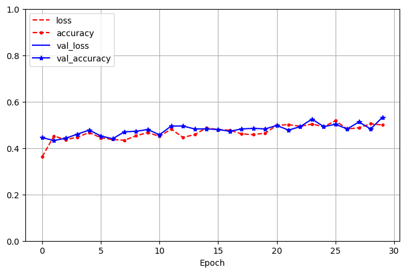
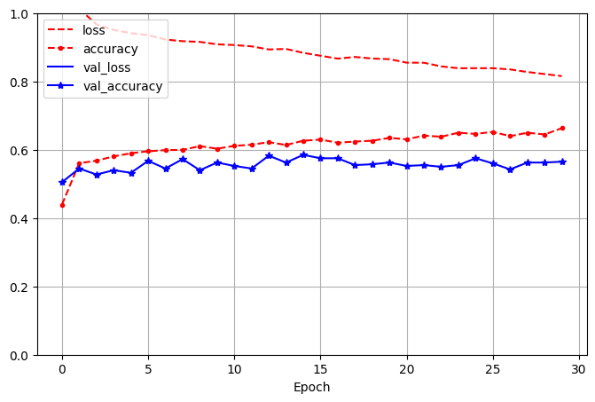
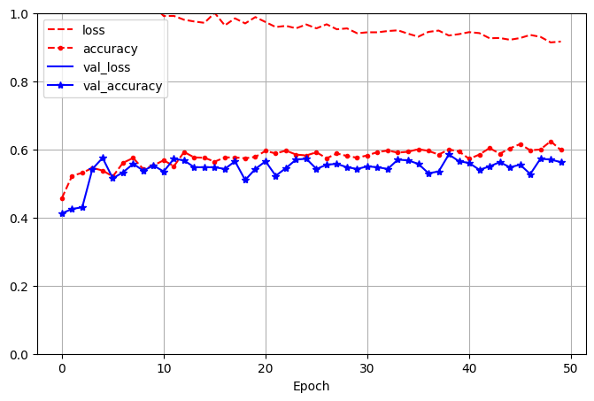
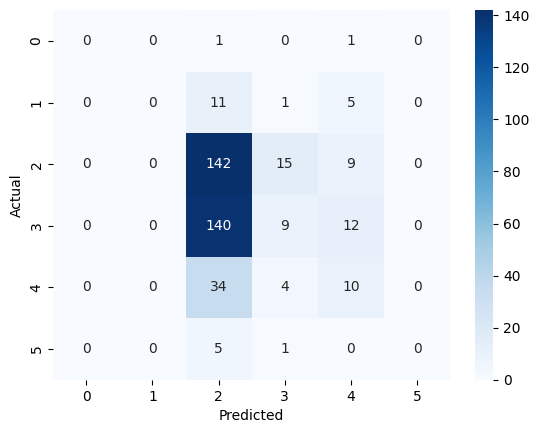

# sommelier
Using Deep Neural Networks with Convolution and Normalization to Score Red Wine Quality

The goal of this project is to read, understand, implement and analyze a puplished research paper relating to neural networks.

# Intro.
The paper I selected to implement and analyze is [Prediction of Red Wine Quality Using One-dimensional Convolutional Neural Networks](https://arxiv.org/abs/2208.14008). The goal of this paper is to show how Deep Neural Network and Convolution are an improvement compared to traditional machine learning models. It auses convolution on non-image data to try and account for the chemical features interaction with eachother. This is because with convolution it normally takes into account surrounding pixel in a dataset but with non image data it can take into account surrounding feature as well.

# Data Analysis
[Dataset](https://archive.ics.uci.edu/dataset/186/wine+quality)

In order to predict the quality of the red wine data it is always a good starting point to analyze the data you have first. The paper focuses on 3 different forms of analysis.
1. Pearson Correlation Analysis
2. Principle Component Analysis
3. Shapiro-Wilk Normalization Test

## Pearson Correlation Analysis

I recreated the correlation matrix. The top matrix is the one I generate and the one below is from the article. The values match perfectly between them which is a good start.

``` python
# Create a correlation matrix for the wine dataset using the Pearson method
mat = dataset.corr(method='pearson', min_periods=1)

# Plot the correlation matrix
plt.figure(figsize=(10, 10))
sns.heatmap(mat, vmax=1, square=True, annot=True, cmap='vlag')
plt.title('Correlation matrix for wine features')
plt.show()

```


## Principal Component Analysis (PCA)

I attempted to recreate this analysis but with lack of how they performed and what parameters they used it was impossible to figureout what PCA they actually did.


## Shapiro-Wilk Normalization Test
I ran the test on each feature. The null hypthesis is that the data is normally destributed. None of the p-values fall below the alpha value of .05 which means we can reject the null hypothesis for all the features. This means non of them are assumed to have a normal distrubution. (Note - The P-values are all very small so they all show up zero in the results table below.)

``` python
from scipy.stats import shapiro
# Conduct a Shapiro-Wilk test for normality
# Null Hypothesis: The data is normally distributed
# Alternative Hypothesis: The data is not normally distributed
# Set alpha to 0.05
alpha = 0.05
for column in dataset.columns:
    stat, p = shapiro(dataset[column])
    print(column, ': Statistics=%.3f, p=%.3f' % (stat, p))
    if p > alpha:
        print('The data is normally distributed (fail to reject H0)')
    else:
        print('The data is not normally distributed (reject H0)')
    #print('\n')
```

Feature Name         | Shapiro-Wilk Test Result
-------------        | -------------------------
fixed acidity        | Statistics=0.942, p=0.000
volatile acidity     | Statistics=0.974, p=0.000
citric acid          | Statistics=0.955, p=0.000
residual sugar       | Statistics=0.566, p=0.000
chlorides            | Statistics=0.484, p=0.000
free sulfur dioxide  | Statistics=0.902, p=0.000
total sulfur dioxide | Statistics=0.873, p=0.000
density              | Statistics=0.991, p=0.000
pH                   | Statistics=0.993, p=0.000
sulphates            | Statistics=0.833, p=0.000
alcohol              | Statistics=0.929, p=0.000
quality              | Statistics=0.858, p=0.000

# Methodology

## Data Transformation
Before any data is feed into the model they first scale the features on a scale from [0,1]. Just used the MinMaxScaler from sklearn to do this step.

``` python
# Create the test and train data from the sorted data
from sklearn.model_selection import train_test_split
from sklearn.preprocessing import MinMaxScaler
from imblearn.over_sampling import SMOTE

# Create the features (X) and target (y) data
X = sort_df.drop('quality', axis=1)
y = sort_df['quality']

# Split the data into train and test sets
X_train, X_test, y_train, y_test = train_test_split(np.asarray(X), np.asarray(y), random_state=24)

# Scale the X_train and X_test data
scaler = MinMaxScaler()

# Fit the scaler
X_scaler = scaler.fit(X_train)

# Scale the data
X_train_scaled = X_scaler.transform(X_train)
X_test_scaled = X_scaler.transform(X_test)
```

At this point this implementation starts to fall apart. This is because the paper starts to leave out alot of details and specifics on how things were actually implemented. They mention for data transformaion they resort the data based on how highly correlated feature are with eachother.

I played around a bit and regenrated the correlation matrix after I sorted to try and see visually if the correlated features were grouping together. You can see below the blue and red valued are more clumped together so I ended up with this list of sorted values.


## 1D-CNN Architecture

The paper provided this picture of the architecture to build the model. This is really the only detail given on how to implement this model. They leave out alot of specifics like how much Dropout they use, How many neurons in the dense layers etc.


Since one of the main purposes of this paper was to use Conv1D on non-image data i expected more details on how this was implemented. I ended up making some assumptions here because I needed to reshape my data before I could feed it into the 1D Conv layer. 

I ended up having to add a dimesion to feature data so the sahpe of the data would actually work with convolution. I added it to the end so the data shape of X_train went from (1199, 11) -> (1199, 11, 1)

I also needed to convert y from its classes from 1-10 into a binary matrix using one hot encoding. This is because I needed to use softmax as the output layer activation. This step took a good bit of time to figure out since there were not alot of people trying to use Convolution on non-image data for classification models.

``` python
X_train_d = tf.expand_dims(X_train_scaled, axis=-1)
X_test_d = tf.expand_dims(X_test_scaled, axis=-1)
print(X_train_d.shape)

# Convert class vectors to binary class matrices. This uses 1 hot encoding.
y_train_binary = tf.keras.utils.to_categorical(y_train, 10)
y_test_binary = tf.keras.utils.to_categorical(y_test, 10)

print(y_train_binary.shape)
print(y_test_binary)

```

## Running the models

In the paper they use similar arcitecture to make 4 different models.

Model   | Details
-----   | -----------
DNN-D   | 4 Dense layers with no dropout or batchnorm layers
DNN     | 4 Dense layers with 3 dropout and batchnorm layers
1DCNN-D | 1 Conv1D layer then Flattend and feed to 4 Dense Layers
1DCNN   | 1 Conv1D layer then Flattend and feed to 4 Dense Layers with 3 dropout and bathnorm layers

### DNN-D
 I got an accuracy of ~61%
``` python
# create DNN-D model
model = tf.keras.models.Sequential([
    tf.keras.layers.Dense(16, activation='relu'), # First Dense layer
    tf.keras.layers.Dense(16, activation='relu'), # Second Dense layer
    tf.keras.layers.Dense(16, activation='relu'), # Third Dense layer
    tf.keras.layers.Dense(16, activation='relu'), # Fourth Dense layer
    tf.keras.layers.Dense(10, activation='softmax')
])
```


### DNN
I got an accuaracy ~51%

``` python
# create DNN model
model = tf.keras.models.Sequential([
    tf.keras.layers.Dense(16, activation='relu'), # First Dense layer
    tf.keras.layers.Dropout(0.2), # First Dropout layer
    tf.keras.layers.BatchNormalization(), # First Batch normalization layer
    tf.keras.layers.Dense(16, activation='relu'), # Second Dense layer
    tf.keras.layers.Dropout(0.2), # Second Dropout layer
    tf.keras.layers.BatchNormalization(), # Second Batch normalization layer
    tf.keras.layers.Dense(16, activation='relu'), # Third Dense layer
    tf.keras.layers.Dropout(0.2), # Third Dropout layer
    tf.keras.layers.BatchNormalization(), # Third Batch normalization layer
    tf.keras.layers.Dense(16, activation='relu'), # Fourth Dense layer
    tf.keras.layers.Dense(10, activation='softmax')
])
```



### 1DCNN-D
I got an accuaracy ~62%

``` python
# create sequential model
model = tf.keras.models.Sequential([
    tf.keras.layers.Conv1D(64, 3, activation='relu', input_shape=X_train_d.shape[1:]),
    tf.keras.layers.Flatten(),
    tf.keras.layers.Dense(32, activation='relu'), # First Dense layer
    tf.keras.layers.Dense(64, activation='relu'), # Second Dense layer
    tf.keras.layers.Dense(32, activation='relu'), # Third Dense layer
    tf.keras.layers.Dense(16, activation='relu'), # Fourth Dense layer
    tf.keras.layers.Dense(10, activation='softmax')
])
```




### 1DCNN
I got an accuaracy ~52%
``` python
# create sequential model
model = tf.keras.models.Sequential([
    tf.keras.layers.Conv1D(11, 2, activation='relu', input_shape=X_train_d.shape[1:]),
    tf.keras.layers.Flatten(),
    tf.keras.layers.Dense(16, activation='relu'), # First Dense layer
    tf.keras.layers.Dropout(0.3), # First Dropout layer
    tf.keras.layers.BatchNormalization(), # First Batch normalization layer
    tf.keras.layers.Dense(16, activation='relu'), # Second Dense layer
    tf.keras.layers.Dropout(0.3), # Second Dropout layer
    tf.keras.layers.BatchNormalization(), # Second Batch normalization layer
    tf.keras.layers.Dense(16, activation='relu'), # Third Dense layer
    tf.keras.layers.Dropout(0.3), # Third Dropout layer
    tf.keras.layers.BatchNormalization(), # Third Batch normalization layer
    tf.keras.layers.Dense(16, activation='relu'), # Fourth Dense layer
    tf.keras.layers.Dense(10, activation='softmax')
])
```




## Evaluation and Comparison

In a comparrison with their models:

Model   | My Accuracy | Paper's Accuaracy
-----   | ----------- | -----------------
DNN-D   | ~61%        | 81%
DNN     | ~51%        | 82.5%
1DCNN-D | ~62%        | 82%
1DCNN   | ~52%        | 83%             

Traditional Models the Paper Compared Against:

Model | Accuracy
----- | --------
kNN   | 77.6%
SVM   | 76.5%
LR    | 75.5%
RF    | 81.0%

# Conclusion
 
 Overall my model's preformed signifigantly worse then the original papers implementation. There were alot of missing details related to specific parameters they used in the paper. There was no Neuron Count for the Dense Layers or numbers on how much Dropout was used. No information on how they resorted the features based on strong correlations.

 I think if I continue to tweek the models I can get a signifigantly better accuracy.

 A couple of things I ran into the paper did not seem to mention was how imbalenced the data set was and if they did anything to combat that. Becuase of how quality rankings are they are naturally gonna have more quality rankings in the mid ranges and not many towards 1 or 10 quality.
 
 Also how the sample sizes was only around 10,000 different red wine rankings. They did address this though as it is a complication of how the industry operates and how wine rankings are not really a popularly produced data point.